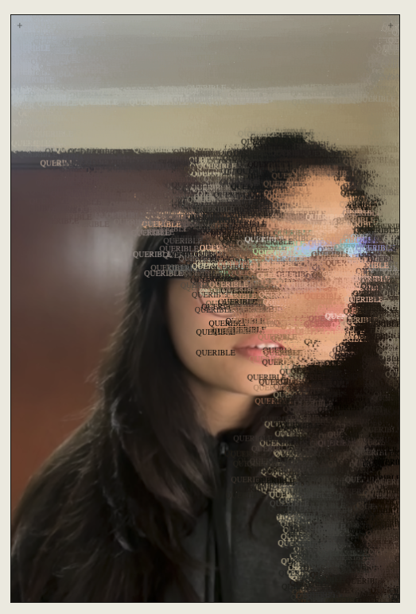

# Espejo



"Espejo" combines the tool used to scrutinize one's own reflection for flaws, and the abuse of filters to alter one's image to conformity.

This is just the code of a bigger proposal: an installation. An ordinary mirror, intervened by this code and placed as a decorative object. It waits for the instinctive glance any mirror invites — typically in search of flaws — and answers it instead with a chosen compliment, rendered onto the person standing before it.

Accordingly, the filter activates only upon facial recognition. Absent a face, the piece remains an ordinary mirror — preserving the surprise element.

Generative art, 2019. Built with [p5.js](https://p5js.org/) and [ml5.js](https://ml5js.org/) (MediaPipe Face Mesh).

## Running locally

Serve the folder with any static file server and open it over `http://` (webcam access requires a secure context, so opening `index.html` directly via `file://` won't work):

```
python3 -m http.server 8000
```

Then visit `http://localhost:8000` and grant camera access.

## Settings

- **Word** — the compliment rendered across the face
- **Size** — text size
- **Rate** — strokes drawn per frame
- **⌘I** — save the current frame as a PNG
